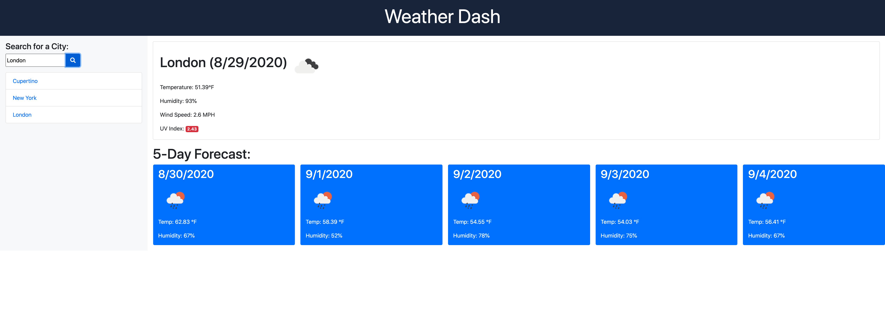

# Weather Dash

## Description

This is a weather dashboard program which utilizes the OpenWeather API in order to get information on weather based on an inputted city. The left side of the page displays the search input form and search history column while the right side of the page displays a large card for today's weather information with 5 day forecasts displayed in 5 cards below.

## Getting Started

* [Github Repository](https://github.com/nathanmvu/weather-dash)
* [Deployed Link](https://nathanmvu.github.io/weather-dash/)
* [Usage Demo Video](https://drive.google.com/file/d/1Cxk5nuVo8uRcOX-DTllw3Swu-BIVJbRp/view)

### Usage

The program intializes as just the header, the search column with an input form and search button next to it, and an large empty container where today's weather information will be displayed. The main weather container displays the inputted city's formatted name, the current date, and a weather icon depicting the weather conditions. In the same card below the city name are the information for present day temperature in Fahrenheit, humidity, wind speed, and UV Index.

Below the present day weather information is the 5-day Forecast section of the page which is organized into 5 cards which display the weather information of the city for the coming 5 days. This information includes the weather icon for the day as well as the temperature and humidity. The information is gathered for the weather predicition for 12 PM of each day.

The search column of the page is where the search input form and search history section are located. In the search input form the user can input a city name and have the information for that city displayed in the weather section as well as the formatted city name displayed in the search history section as a clickable button link which will display the weather information of the city that is clicked.

### Screenshots

Initial Page:

First Search:

Second Search:

Third Search:

Search History Clicked:

## Author

* **Nathan Vu** - [Github Profile](https://github.com/nathanmvu)

## Acknowledgments

* Project parameters provided by the UCB Extension Coding Bootcamp

## License

This project is licensed under the MIT License 

